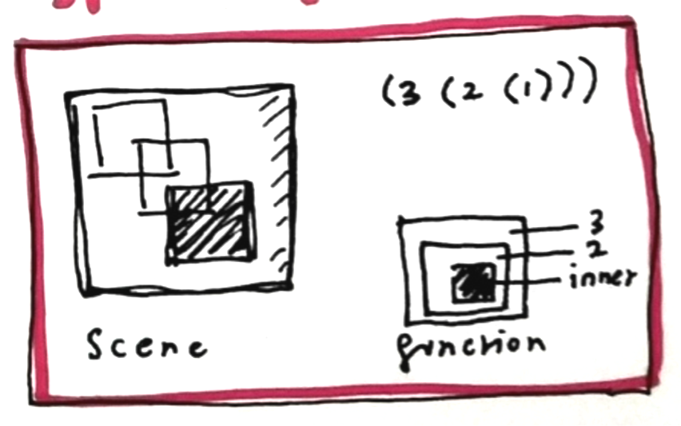
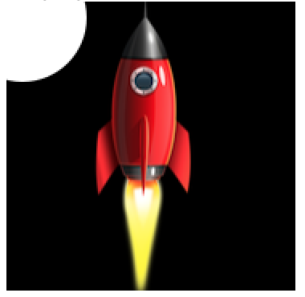

<!-- Front of card ===========================================================

    Draw! Card Data

    - Type:
        What's the answer?

        ⚠️ For now this is simply a clone of a simple
        `question->answer` card; but with images! We're
        asking the question something along the lines of:
        _"what does this code do?"_, or _"how might I
        sketch this idea out?"_ e.g:

        - A whiteboard diagram with a small program or
          function: You have to remember or guess something
          about it.
        - A function or program that you need to sketch
          out. Something you'd like to drill yourself with
          to rememeber.

    - Docs:
        @ #! tinyurl link to come later

    - Key:
        ★ Required
        ☆ Optional (recommended)
        ✎ Optional (notes, markdown)
        ⤷ Field Type

    - Notes:
        Where fields are auto-wrapped with an HTML tag, copy/paste the compiled
        data _within_ those tags in your Anki fields, otherwise you'll have
        formatting issues. For example:

            `★ Title` field:

            <h1>What happens is we type <code>Model</code> in the repl?</h1>
                -------------------------------------------------------
            xxxx                                                       xxxxx

        Compiled data is simple meant to speed up the card creation process —
        it's not meant to be viewed in the browser. Best viewed in a text editor (such as Visual Studio Code) to copy/paste your Anki field data.

========================================================================== -->


<!-- -------------------------------------------------------------------------
    ★ Title

    ⤷ `string` (auto wrapped with a `H1` tag)
-------------------------------------------------------------------------- -->
# What's special about the way we're layering in Racket Lang's [images teachpack](https://docs.racket-lang.org/teachpack/2htdpimage.html)?


<!-- -------------------------------------------------------------------------
    ☆ Subtitle

    ⤷ `string` (auto wrapped with a `H2` tag)
-------------------------------------------------------------------------- -->
## 2htdp/image


<!-- -------------------------------------------------------------------------
    ☆ Syntax (inline code)

    ⤷ `code string` (auto wrapped with <p><code> tag)
-------------------------------------------------------------------------- -->
`(require 2htdp/image)`


<!-- -------------------------------------------------------------------------
    ★ Sample (image)

    ⤷ `image`

      | May require the `markdown->html` compiler in future

      An image that asks the question "what does this code do?"_,
      or "how might I sketch this idea out?".

      The image will need to be added to Anki first, or you can store it
      in the cloud somewhere, and link to it like this.
-------------------------------------------------------------------------- -->



<!-- Back of card ======================================================== -->


<!-- -------------------------------------------------------------------------
    ★ Key point (image)

    ⤷ `draw`

      | May require the `markdown->html` compiler in future

      An image that shows the answer to "what does this code do?"_,
      or "how might I sketch this idea out?".

      The image will need to be added to Anki first, or you can store it
      in the cloud somewhere, and link to it like this.
-------------------------------------------------------------------------- -->



<!-- -------------------------------------------------------------------------
    ★ Key point notes

    ⤷ `rich html`
-------------------------------------------------------------------------- -->
Lisp feels a bit back-to-front and inside-out when you first start! Our background is the innermost item, and our rocket the outermost (wrapped in `place-image` function)

```racket
(require 2htdp/image)

; Here's the constants

(define WIDTH 180)
(define HEIGHT 180)
(define MIDDLE (/ WIDTH 2))

(define BACKGROUND
  (rectangle WIDTH HEIGHT "solid" "black"))

(define ROCKET
  (bitmap/file "rocket.png"))

(define MOON
  (circle 40 "solid" "white"))

; Let's make our image!

(place-image
  MOON 10 10
    (place-image
      ROCKET MIDDLE MIDDLE
        BACKGROUND))
```

<!-- -------------------------------------------------------------------------
    ✎ Other notes

    ⤷ `rich html`
-------------------------------------------------------------------------- -->
Lisp calculates the _inner-most_ function (data or variable) FIRST. It then works inside-out to render our `ROCKET`.

<!-- -------------------------------------------------------------------------
    ✎ Markdown

    ⤷ `raw text`

      Do not add the compiled HTML to your card, rather, use the raw text
      Markdown fenced code block. This makes for easier editing of a card
      later on.

      Warning: may increase card file size
        @ https://github.com/badlydrawnrob/anki/issues/116
-------------------------------------------------------------------------- -->
The original problem has the following note (which isn't really needed now):


```racket
; Each object image can be passed as a (render-obj ... img) — for nested img!
; I think this was using a `define struct` or something.
(define (render-obj obj img)
  (place-image obj (posn-x img) (posn-y img)
    img))
```
